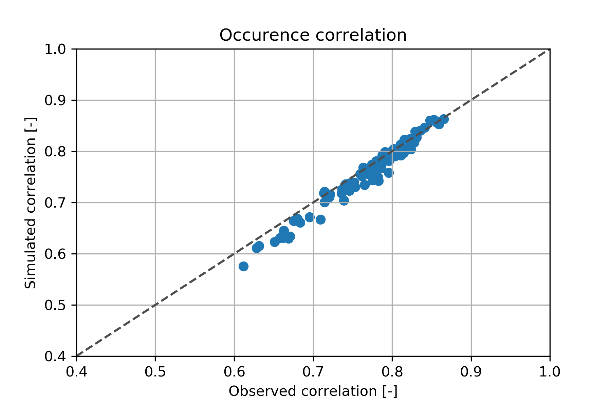

# 3d-rainfall-generator
In this project we investigate if it is possible to combine traditional weather generators, stochastic storm transposition and general data science to create long term continuous rainfall time series at multiple site locations.

## Things to do:

## Changelog

 

## Description

