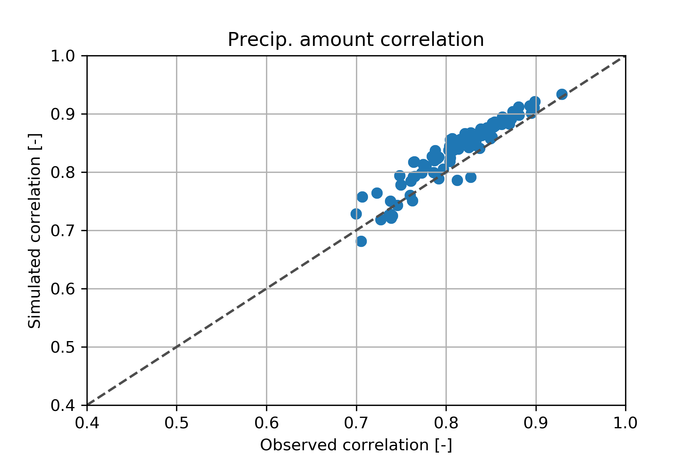

# 3d-rainfall-generator
In this project we investigate if it is possible to combine the [mulGETS][doi:10.1016/j.jhydrol.2007.06.035] rainfall generator, [Stochastic Storm Transposition][http://dx.doi.org/10.1016/j.jhydrol.2013.03.003] and general data science to create long term continuous rainfall time series at multiple site locations.

## Things to do:

* ~~Implement the mulGETS model in python.~~
* ~~Compare correlation of mulGETS and observation data.~~
* Compare annual statistics of mulGETS model to observation data.
  * Also compare low frequency variability of the model output ([This paper][https://doi.org/10.1016/j.jhydrol.2019.05.047] suggest that this are modelled poorly by this model).
  * If this is the case, investigate if a time varying Markov chain can fix this problem.
* Autoencode data from a [RainyDay][https://github.com/danielbwright/RainyDay2] output with Principal Component Analysis (PCA).
  * The autoencoding is used to determine if certain days from the RainyDay can be substituted into the mulGETS model output.
* Autoencode data from RainyDay using:
  * Densely connected neural network.
  * Deeply connected neural network.
* Develop a "plugin" to RainyDay to allow long term simulation of rainfall in time (subdaily) and space (data dependent resolution)

# The mulGETS model

The general procedure and methodology is presented in [this][doi:10.1016/j.jhydrol.2007.06.035] paper, but the general outline is:

* Fit a Markov chain to every rainfall station of interest. An example of 23 years of daily rainfall is available in this github.
* Determine the correlation matrix needed, to simulate the observed correlation of either rainfall occurrence and precipitation amount.
* Establish link between occurrence index (number of "wet" station at once, relative to the interstation correlation) and average seasonal precipitation. Use this information to construct a multi-exponential distribution for each station.

## Results

In this section we will run through the output of the mulGETS model.

### Spatial coherence

Figure 1 displays the observed and simulated correlation of both daily rainfall occurrences and daily rainfall amounts. 

A             |  B
:-------------------------:|:-------------------------:
  |  
*Figure 1: (A) Interstation correlation. (B) Precipitation amount correlation.*

The mulGETS model is quite succesfull at simulating these two parameters. For some reason there is a small error on the right-hand figure (the precipitation amounts). Our initial suspension is that it could be caused by either: the fact that the occurence correlation matrix converges on a somewhat high error (0.446) where the mulGETS paper reports on an error in the 1e-3. The paper also mentions making adjustment to the multi-exponential distribution, which we have not done. 

Overall the results presented on figure shows that the mulGETS model retains the spatial coherence of the rainfall field.

### Annual and seasonal precipitation
Figure 2 displays the observed mean annual and seasonal precipitation, compared with the simulated ones from the mulGETS model.

A             |  B
:-------------------------:|:-------------------------:
  |
C              |  D
  |